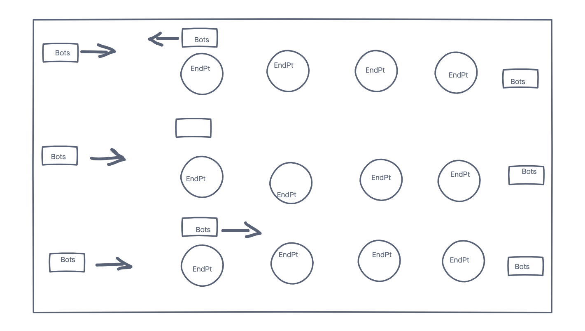

# Bots
# Inspiration
While I worked at Amazon's Fulfillment there were robots that would take packages and deliver them to a selected section. There are about 50-60 robots navigating the floor at the same time. They stop and wait at an intersection if there are other robots crossing. In this project I will try to replicate a visual of this work flow. 
***
# Description
The application will display numerous robots reaching random destination as quickly as possible while avoiding other robots/obstacles.
***
# Technologies

***
# Wireframe
